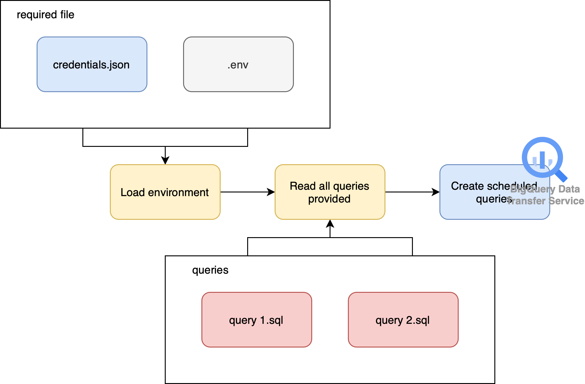

# BIGQUERY CREATE SCHEDULED QUERIES
## What Is This For?
This program is to create scheduled queries in GCP BigQuery. Commonly, when we create new scheduled query in BigQuery, it will use our personal/work credential/email. Once we left the company and our work credential is deactivated, the task that was created with our credential will stop and return error.

The purpose of this program is automatically create that with credential provided instead of our personal/work credential. This will maintain the scheduled queries we created keep running although our credential is deactivated.

Every run of this program is designed to create scheduled queries with the same schedule.



## What Is In It?
There are 2 python files and 1 folder as a place to store queries.
- Python files
    - `main.py` is the main file to run the program.
    - `helpers.py` is the file that contains a function to create the scheduled queries based on queries provided.
- Folder for queries
    - `scheduled_queries` is a folder that is supposed to contain queries that will later create as scheduled queries in BigQuery. This folder can contains as many as query that has extension `.sql`. Each name of the file later will be the display name of the scheduled queries in BigQuery. The name of the folder can be specified later in `.env` file.

## What Is Required To Setup?
- You need to set a `.env` file to provide every configuration needed by the program to run. Below is the variables needed to provide in the file.
    ```
    QUERIES_DIR=folder-where-queries-are-stored
    GOOGLE_APPLICATION_CREDENTIALS=your-gcp-credential
    BQ_PROJECT_ID=your-project-id
    BQ_PROJECT_LOCATION=your-project-location-id
    ```
    `QUERIES_DIR` currently is set to `scheduled_queries`.
- Generate IAM service credential file from GCP that has access to create scheduled query in BigQuery.

## How To Run The Program?
I suggest you to use python virtual environment to separate the environment between project. You can find how to create and use it in [python documentation page](https://docs.python.org/3/library/venv.html).

After activating virtual environment, please follow below steps.
1. You need to install all the dependencies required. All dependencies are provided in file `requirements.txt`. To install this, you can run the command below.
    ```
    pip install -r requirements.txt
    ```
2. Provide each query you want to make as scheduled queriy in provided folder (in current use case, we use `scheduled_queries` as folder name). Example as follows.
    `create new table.sql`
    ```sql
    CREATE OR REPLACE TABLE dest_dataset.dest_table
    AS
    SELECT *
    FROM source_dataset.source_table;
    ```
3. Run the script by writing below command.
    ```
    python main.py [schedule]
    ```
    Example as follows.
    ```
    python main.py "every day 08:00"
    ```
    This will create all the queries in `scheduled_queries` as scheduled query in BigQuery with the schedule as every day at 8 o'clock.